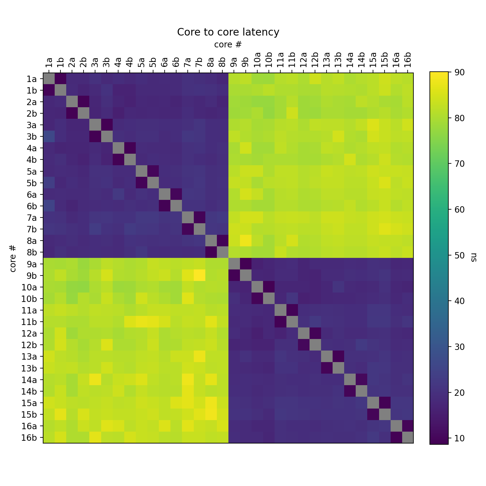
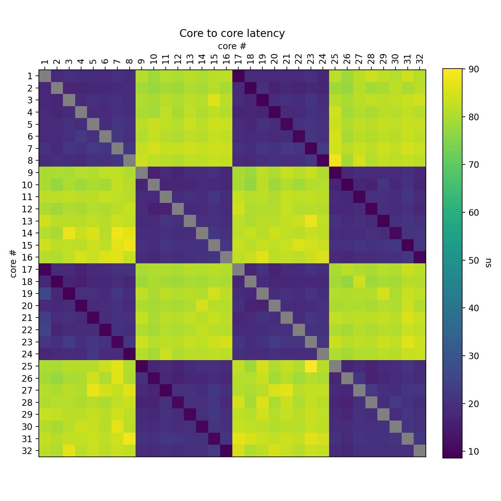

# Visualize core-to-core latency

## Usage
Type
```bash
make
```
and see `core-to-core-latency.png`.

By default the plot assumes your cores have SMT with two hardware threads per
core and reorders them such that threads of the same core are adjacent. Below is
an example from a 16-core Ryzen 5950x with SMT, the two large blocks on the
diagonal reveal the two 8-core CCDs/CCXs.


The two hardware threads (a and b) of the same core show the lowest
communication latency. The diagonal itself is empty (visualized as gray) because
communication speed between two (software) threads running on the same hardware
thread (core) was not measured.

To disable SMT aggregation behavior, run
```bash
make SMT=0
```
This only affects visualization and not measurement.
In this case the plot assumes the hardware threads are truly independent cores.


## Acknowledgements
The code is a port of Nicolas Viennot's Rust
[project](https://github.com/nviennot/core-to-core-latency) to C.
